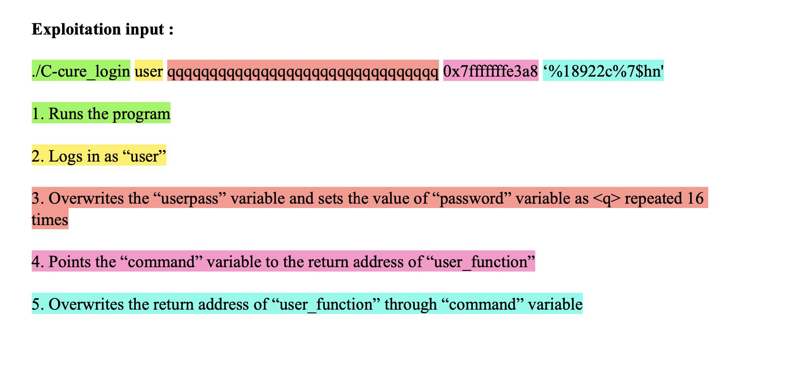

# C-cure_exploitable_code

##1. Backstory
Welcome to C-cure logging services provided by the C-cure research foundation for curing cancer in children. It is a small research group with limited funding but they have a lot of hardworking, smart and highly under-paid doctors doing the good work. You, on the other hand, are an evil hacker pretending to be a volunteer and are trying to exploit their login service that helps them do the good work. They did not have the money to hire a professional developer so an intern doctor who knew a thing or two about computers coded it.

##2. Program Functionality
The program accepts 4 arguments : username, password, command and a message. The program allows 2 logins: user and admin. The "user" is the account for the head doctor to write their personal mottos for the kids at the institute to see. The admin uses it to simply see what processes are going on.

##3. Program Details
The program has 3 functions : main, user_function and admin_function. When the main function receives the login information from "user" or "admin", it checks their passwords and calls a respective function to perform the desired user actions.

##4. Goal
You, as mentioned before, are an evil hacker who wants to interrupt the nice work some people are trying to do. So, you have to spawn a the adminSH.sh shell (only accessible by the root user) from this program.

##5. Exploits Used
This program uses 3 exploits in total: 2 types of buffer overwrite attacks (overwriting a variable and overwriting the return address) and an environment variable based attack.

##6. Exploitation Explained
To do your dirty work, you must first overwrite the "userpass" variable by passing 32 characters in "password" variable to make them the same. Alternatively, you can just run the code in a debugger and find out the actual password of "user" and bypass the check. (The original intention was to make it so that it is not visible in gdb, but I never figured how to do that, so we have alternatives..)
Next, you have to overwrite the return address of the "user_function" and point it to the "admin_function" function, which uses an execv() call. Finally, you have to temporarily set the environment variable "ps" to drop the admin.SH shell.

**The user_password and admin_password files are supposed to be not accessible to the hacker. Also, the adminSH.sh shell is also not supposed to be launched by the hacker with their privileges.